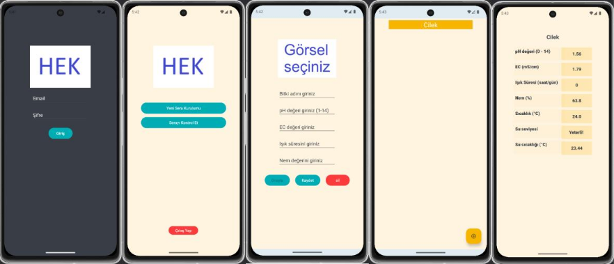
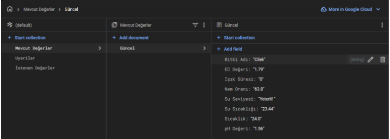

# HEK2 - Akıllı Topraksız Tarım Mobil Uygulaması

Bu repository, TÜBİTAK ve KTÜ BAP birimi tarafından desteklenmiş olan **"Yapay Zekâ Tabanlı Otonom Topraksız Tarım Serası" adlı bitirme projem kapsamında geliştirdiğim mobil uygulamayı** içermektedir. Uygulama, kullanıcıların hidroponik seralarını yönetmesine ve izleyebilmesine olanak sağlar.

---

## 📌 1. Uygulama Akışı

### Giriş Ekranı
- Kullanıcı, uygulamayı açtığında mail ve şifre ile sisteme giriş yapar.  
- Başarılı girişten sonra ana menüye yönlendirilir.

### Ana Menü
- **Yeni Sera Kurulumu**: Kullanıcı yetiştirmek istediği bitkiyi listeden seçer veya sağ alt köşedeki artı simgesine tıklayarak yeni bir bitki ekleyebilir.  
- **Kontrol Et**: Kullanıcı mevcut serasını izleyebilir; pH, EC, nem, sıcaklık, ışık süresi ve son çekilen fotoğraf gibi verilere erişebilir.

### Yeni Sera Kurulumu
- Bitki seçildikten sonra bilgiler veri tabanına kaydedilir ve sistem yeni bitkiye ait verileri almaya başlar.  
- Ekran tasarımı kullanıcı dostu ve basit şekilde düzenlenmiştir.

### Kontrol Et
- Seranın durumu canlı olarak görüntülenebilir.  
- Ölçülen değerler ve seraya ait fotoğraflar kullanıcıya sunulur.  
- Tasarım, farklı ekran boyutlarına uyumlu olarak geliştirilmiştir.

---

## 📌 2. Firebase Entegrasyonu

- Uygulama, **Firebase Firestore** kullanarak veri tabanına bağlanır.  
- `google-services.json` dosyası proje dizinine eklenmemiştir. Kendi entegrasyonunuzu sağlamanız gerekmektedir.  
- Kullanıcı arayüzü, verilerin gerçek zamanlı olarak alınması ve gösterilmesine göre optimize edilmiştir.

---

